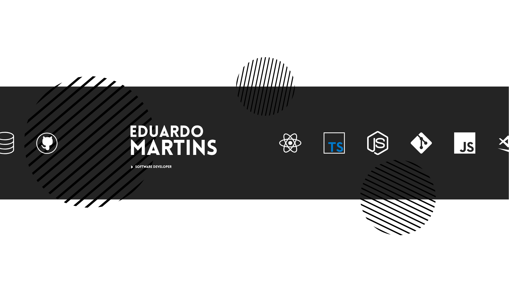

---

#### About me: 
  - I'm software developer since 2025
  - React | TypeScript | NodeJS
  - I'm a science computer student
  - Always trying to learn more and more
  - To get to know me better: [linkedin](https://www.linkedin.com/in/eduardo-martins-524102253/), [instagram](https://www.instagram.com/du.mrtss) or [email](mailto:duduestevesmartins@gmail.com)

#### Languages ans tools:

  &nbsp;&nbsp;&nbsp;&nbsp;
  &nbsp;&nbsp;&nbsp;&nbsp;
  &nbsp;&nbsp;&nbsp;&nbsp;

   
